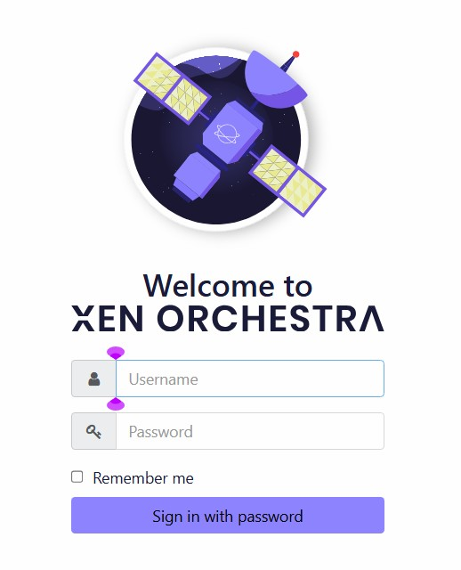
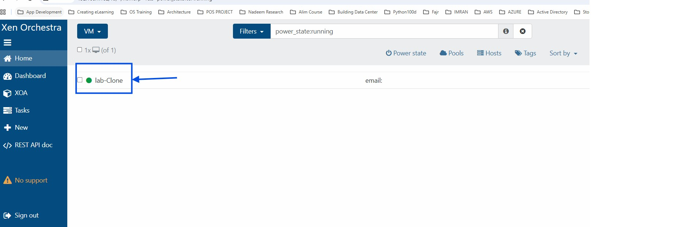
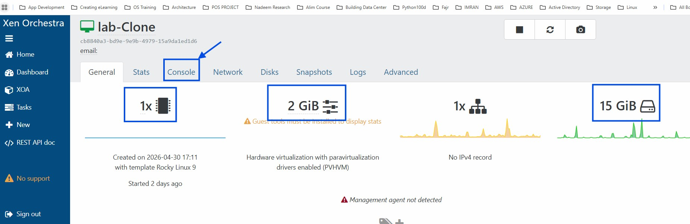
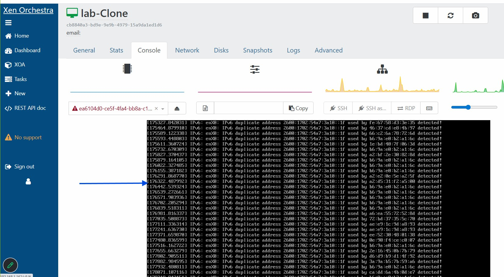
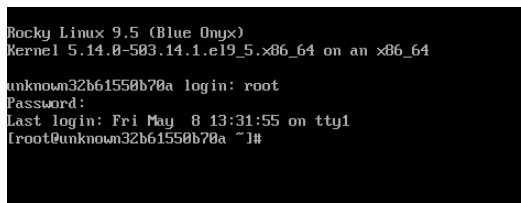

# NIT اکیڈمی میں خوش آمدید - دن 1

## فہرست

| ٹاسک | عنوان | خلاصہ |
|------|------|------|
| 1 | [اپنے ورچوئل مشین تک رسائی حاصل کریں](#task-1---اپنے-ورچوئل-مشین-تک-رسائی-حاصل-کریں) | یونیکس/لینکس کا تعارف |
| 2 | [لینکس شیل کیا ہے؟](#task-2---لینکس-شیل-کیا-ہے) | ورچوئل مشین میں لاگ ان کریں اور لینکس کمانڈ لائن (CLI) تک رسائی حاصل کریں |
| 3 | [گٹ ہب اکاؤنٹ رجسٹر کریں](#task-3---گٹ-ہب-اکاؤنٹ-رجسٹر-کریں) | اپنا گٹ ہب اکاؤنٹ بنائیں |
| 4 | [لینکڈ ان رجسٹر کریں یا اپڈیٹ کریں](#task-4---لینکڈ-ان-رجسٹر-کریں-یا-اپڈیٹ-کریں) | لینکڈ ان پروفائل بنائیں یا بہتر بنائیں |
| 5 | [گٹ بیش انٹال کریں](#task-5---گٹ-بیش) | ونڈوز پر گٹ بیش انٹال کریں |
| 6 | [ویژول اسٹوڈیو کوڈ](#task-6---ویژول-اسٹوڈیو-کوڈ) | ویژول اسٹوڈیو کوڈ انٹال کریں |
| 7 | [ڈسکورڈ](#task-7---ڈسکورڈ) | ڈسکورڈ انٹال کریں اور شامل ہوں |

---
# ہم اب اپنا لینکس سفر شروع کررہے ہیں
براہ کرم اسے سنجیدگی سے لیں اور تمام اسائنمنٹس وقت پر مکمل کریں۔

# ٹاسک 1 - اپنے ورچوئل مشین تک رسائی حاصل کریں؟
1. Xen-Orchestra تک رسائی
نیچے دیے گئے لنک پر کلک کریں تاکہ لاگ ان صفحہ تک رسائی حاصل کریں\
[Xen-Orchestra](https://labs.nit.academy)

\
اپنے کریڈینشلز داخل کریں:
```Text
یوزر نیم:
پاس ورڈ:
```
2. اپنے ورچوئل مشین (VM) کنسول پر نیویگیٹ کریں
اس ورچوئل مشین پر کلک کریں جس میں "سبز" ڈاٹ ہو:\


اپنے ورچوئل مشین کے وسائل کا جائزہ لیں:\


"Console" ٹیب پر کلک کریں:\

```Text
مرحلہ 1 - "سیاہ باکس" میں کلک کریں
مرحلہ 2 - "Enter Key" دبائیں
```


```bash
   unknowna1alsdjfals5 Login: root
   Password: abc
   Last login: Sat Apr 18 02:51:09 on tty1
```
3. آئیے اس IPv6 اوور فلو کے مسئلے کو درست کرتے ہیں۔
جب ہم نیٹ ورکنگ سیکھیں گے تو ہم سمجھیں گے:
- ip4 بمقابلہ ipv6
- سٹیٹک IP کی اہمیت
- نیٹ ورکنگ مسائل کا ازالہ

نوٹ: IPv6 کو غیرفعال کرنے کا مستقل حل
آئیے sysctl کنفیگریشن فائل میں ترمیم کریں\
مندرجہ ذیل فائل کھولیں:

```bash
<root@vm1>#vi /etc/sysctl.conf
```
اپنے کیبورڈ پر "i" کی دبائیں

اسکرپٹ کے نیچے سکرول کریں اور اسکرپٹ کے آخر میں یہ لائنیں شامل کریں
net.ipv6.conf.all.disable_ipv6 = 1\
net.ipv6.conf.default.disable_ipv6 = 1

"Esc" کی دبائیں
ٹائپ کریں:
:wq
پھر Enter دبائیں

تبدیلیاں لاگو کریں:
```bash
<root@vm1>#sysctl -p
```
### ٹاسک اب مکمل ہوگیا ہے!

# ٹاسک 2 - لینکس شیل کیا ہے؟

1. **شیل (انٹرفیس)**  
   شیل کو آپریٹنگ سسٹم کی "بیرونی تہہ" کی طرح سمجھیں (جیسے کسی مٹیال کے بیرونی خول کی طرح)۔ یہ وہ ماحول ہے جہاں آپ اپنے ہدایات ٹائپ کرتے ہیں۔

   **analogی:**  
   شیل آپ اور کمپیوٹر کے درمیان چیٹ ونڈو کی طرح ہے۔ آپ کچھ ٹائپ کرتے ہیں، اور یہ کمپیوٹر کے جواب کا انتظار کرتا ہے۔

2. **Interpreter (Translator)**
   Interpreter وہ پروگرام ہے جو شیل کے اندر چل رہا ہے۔ کمپیوٹر انگریزی نہیں بولتے؛ وہ بینری (1s اور 0s) بولتے ہیں۔ Interpreter وہ الفاظ جو آپ ٹائپ کرتے ہیں اور انہیں اس زبان میں ترجمہ کرتا ہے جو کمپیوٹر کا "دماغ" (kernel) سمجھتا ہے۔

   **analogy:**  
   Interpreter دو لوگوں کے درمیان بیٹھا ہوا ترجمان ہے جو مختلف زبانیں بولتے ہیں۔

3. **کمانڈ لائن (ایکشن)**
   کمانڈ لائن بس وہ خاص لائن ہے جسے آپ کام مکمل کرنے کے لیے ٹائپ کرتے ہیں۔ اس کا عام طور پر سادہ "Verb + Object" ساخت ہوتی ہے۔

   مثال:
   ```bash
   <root@vm1>#whoami
   ```
   ## "پہلے تیرہ" کمانڈز

| کمانڈ | یہ کیا کرتی ہے | اس کی اہمیت |
|----------|---------------|----------------|
| `whoami` | آپ کا یوزر نیم دکھاتا ہے۔ | تصدیق کرتا ہے کہ سسٹم سے کون بات کر رہا ہے۔ |
| `pwd` | **Print** Working Directory۔ | بتاتا ہے کہ آپ فولڈر سسٹم میں کہاں ہیں۔ |
| `ls` | فائلیں **List** کرتا ہے۔ | دکھاتا ہے کہ آپ کے موجودہ فولڈر میں کیا ہے۔ |
| `date` | موجودہ وقت/تاریخ دکھاتا ہے۔ | سادہ ثبوت ہے کہ **Interpreter** کام کر رہا ہے۔ |
| `clear` | سکرین صاف کرتا ہے۔ | "کمانڈ لائن اینکائیٹی" کم کرنے کے لیے ضروری۔ |
| `ip a` | نیٹ ورک انٹرفیس اور IP ایڈریس دکھاتا ہے۔ | نیٹ ورک پر اپنے مشین کی شناخت کرنے میں مدد کرتا ہے۔ |
| `hostnamectl` | سسٹم کا hostname اور آپریٹنگ سسٹم کی تفصیلات دکھاتا ہے۔ | مشین اور سسٹم کی معلومات کی شناخت میں مدد کرتا ہے۔ |
| `hostnamectl set-hostname <your-hostname>` | سسٹم کا hostname تبدیل کرتا ہے۔ | سرورز کے نام دینے اور نیٹ ورک یا لیب میں سسٹمز کو منظم کرنے کے لیے مفید ہے۔ |
| `uptime` | دکھاتا ہے کہ سسٹم کتنا وقت سے چل رہا ہے۔ | سسٹم کی استحکام اور بوجھ کی نگرانی میں مدد کرتا ہے۔ |
| `reboot` | آپریٹنگ سسٹم کو دوبارہ شروع کرتا ہے۔ | تبدیلیاں لاگو کرنے یا بحالی کے لیے عام انتظامی کمانڈ ہے۔ |
| `passwd` | صارف کا پاس ورڈ تبدیل کرتا ہے۔ | اکاؤنٹ کی حفاظت اور صارف کے انتظام کے لیے ضروری ہے۔ |
| `/bin/bash` | نیا Bash shell لانچ کرتا ہے (عام طور پر non-login shell)۔ | shell میں داخل ہونے یا故障 کی ازالے کے لیے مفید ہے۔ |
| `exit` | موجودہ shell سیشن بند کرتا ہے۔ | محفوظ طریقے سے لاگ آؤٹ ہوتا ہے یا ٹرمینل سیشن سے نکلتا ہے۔ |
    
# ٹاسک 3 - گٹ ہب اکاؤنٹ رجسٹر کریں
### GIT کا مطلب ہے "Global Information Tracker"
اس لنک پر کلک کریں https://github.com/
## گٹ ہب اکاؤنٹ سیٹ اپ کے مراحل

| مرحلہ | عمل | تفصیل |
|------|---------|-------------|
| 1 | گٹ ہب ویب سائٹ کھولیں | https://github.com پر جائیں |
| 2 | سائن اپ پر کلک کریں | ہوم پیج پر **Sign up** بٹن دبائیں |
| 3 | معلومات داخل کریں | اپنا ای میل، یوزر نیم، اور پاس ورڈ شامل کریں |
| 4 | ای میل کی تصدیق کریں | اپنا ای میل کھولیں اور تصدیق لنک پر کلک کریں |
| 5 | پروفائل مکمل کریں | ضرورت ہو تو پروفائل کی تفصیلات شامل کریں |
| 6 | لاگ ان کریں | اپنے نئے گٹ ہب اکاؤنٹ میں سائن ان کریں |
| 7 | ریپوزٹری بنائیں | **+** پر کلک کریں → **New repository** |
| 8 | ریپوزٹری کا نام شامل کریں | پروجیکٹ/ریپوزٹری کا نام داخل کریں |
| 9 | README شامل کریں | **Add README file** چیک کریں |
| 10 | ریپوزٹری بنائیں | **Create repository** پر کلک کریں |

# ٹاسک 4 - لینکڈ ان رجسٹر کریں یا اپڈیٹ کریں
اس لنک پر کلک کریں https://www.linkedin.com/\
لینکڈ ان پر اپنا اکاؤنٹ بنائیں

# ٹاسک 5 - گٹ بیش
اس لنک پر کلک کریں https://git-scm.com/install/windows
## گٹ بیش سیٹ اپ کے مراحل

| مرحلہ | عمل | تفصیل |
|------|---------|-------------|
| 1 | گٹ بیش ڈاؤن لوڈ کریں | https://git-scm.com/download/win پر جائیں |
| 2 | انسٹالر چلائیں | ڈاؤن لوڈ کردہ `.exe` فائل کھولیں |
| 3 | انسٹالیشن شروع کریں | سیٹ اپ میں **Next** پر کلک کریں |
| 4 | PATH آپشن کا انتخاب کریں | انتخاب کریں: **Git from command line and also from 3rd-party software** |
| 5 | HTTPS بیک اینڈ | انتخاب کریں: **Use the OpenSSL library** |
| 6 | لائن اینڈنگ کا آپشن | انتخاب کریں: **Checkout Windows-style, commit Unix-style line endings** |
| 7 | گٹ انسٹال کریں | **Install** پر کلک کریں |
| 8 | سیٹ اپ مکمل کریں | **Finish** پر کلک کریں |
| 9 | گٹ بیش کھولیں | اسٹارٹ مینیو سے گٹ بیش کو لانچ کریں |
| 10 | انسٹالیشن کی تصدیق کریں | `git --version` چلائیں |
| 11 | یوزر نیم کنفیگر کریں | `git config --global user.name "Your Name"` چلائیں |
| 12 | ای میل کنفیگر کریں | `git config --global user.email "you@example.com"` چلائیں |
| 13 | کنفیگریشن کی تصدیق کریں | `git config --list` چلائیں |
| 14 | SSH کی جنریٹ کریں | `ssh-keygen -t ed25519 -C "you@example.com"` چلائیں |
| 15 | SSH کی گٹ ہب میں شامل کریں | پبلک کی کو GitHub SSH سیٹنگز میں کاپی کریں |
| 16 | کنکشن ٹیسٹ کریں | `ssh -T git@github.com` چلائیں |

# ٹاسک 6 - ویژول اسٹوڈیو کوڈ
اس لنک پر کلک کریں https://code.visualstudio.com/download

# ٹاسک 7 - ڈسکورڈ
!! انتہائی اہم !!

جیسا کہ پہلے بیان کیا گیا، NIT کے تمام لوگوں کے لیے ڈسکورڈ سرور تیار ہے! براہ کرم اس لنک کے ذریعے شامل ہوں: https://discord.gg/UeVHUzz25A

براہ کرم یہ بھی نوٹ کریں کہ ہم باقاعدگی سے WhatsApp کے ساتھ ساتھ مواصلت کے ایک اضافی طریقے کے طور پر ڈسکورڈ کا بھی استعال کریں گے۔

# حتمی خلاصہ
آج آپ نے سیکھا:

- ورچوئل مشین تک رسائی حاصل کرنا
- لینکس شیل کی بنیادی باتیں
- بنیادی لینکس کمانڈز
- گٹ ہب اکاؤنٹس بنانا
- گٹ بیش انسٹال کرنا
- VS Code انسٹال کرنا
- ڈسکورڈ سیٹ اپ کرنا

NIT اکیڈمی میں اپنے لینکس سفر میں خوش آمدید!