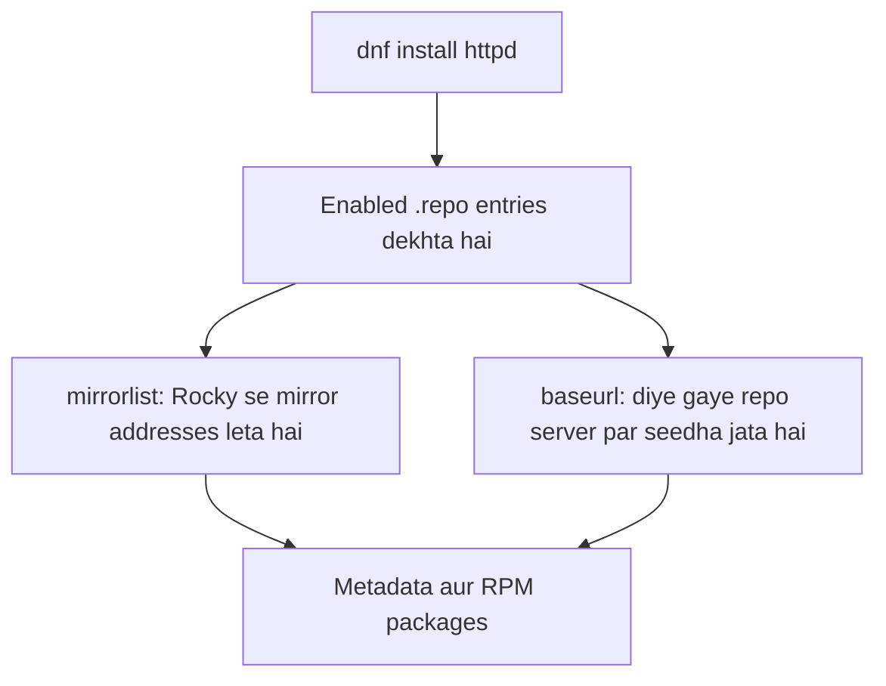

# Linux Project 02: Software Repository Configuration

## RHCSA Lab

### Exam ka sawal

Repo server par mojood in do repositories ko configure karein:

```text
http://repo.eight.example.com/BaseOS
http://repo.eight.example.com/AppStream
```

**Asaan alfaaz mein:** Apni exam VM par DNF ko batana hai ke BaseOS aur AppStream ke packages in diye gaye addresses se kahan milenge.

> `repo.eight.example.com` exam network ka address hai. Aap ke ghar ke network par zaroori nahin ke yeh address khule. Apni Rocky VM ki chalti hui default repositories ko practice ke liye bila wajah delete na karein.

## Pehle tasawwur samjhein



- **`mirrorlist=`:** DNF pehle mirror service se available download servers ke addresses leta hai. Phir un mirrors se repository metadata aur RPM packages download karta hai.
- **`baseurl=`:** DNF ko repository ka seedha address diya jata hai. Exam mein hamein yehi do direct URLs mile hain.
- Dono raaston mein BaseOS aur AppStream *repository ki qisam* hain; farq yeh hai ke packages kis server se liye ja rahe hain.

### BaseOS aur AppStream kya hain?

| Repository | Is mein kya hota hai? | Misal |
| --- | --- | --- |
| **BaseOS** | Operating system ke bunyadi components, jaise kernel aur zaroori system tools | Ghar ki bunyaad |
| **AppStream** | Mazeed applications, programming languages, runtimes aur databases | Ghar mein istemal hone wale tools aur services |

Rocky Linux 9 mein yeh aam repositories hain. `dnf install` enabled repositories mein package aur us ki dependencies dhoondta hai.

```bash
dnf info bash
dnf info python3
```

Yeh commands package ki information dikhati hain; output mein us ka repository source bhi dekhein.

Reference: [Red Hat ki RHEL 9 repository documentation](https://docs.redhat.com/en/documentation/red_hat_enterprise_linux/9/html/considerations_in_adopting_rhel_9/ref_repositories_considerations-in-adopting-rhel-9).

## Step 1: VM par enabled repositories dekhein

```bash
dnf repolist
```

Aap ki VM par misali output:

```text
repo id             repo name
appstream           Rocky Linux 9 - AppStream
baseos              Rocky Linux 9 - BaseOS
docker-ce-stable    Docker CE Stable - x86_64
extras              Rocky Linux 9 - Extras
```

`repo id` har repository ka mukhtasar naam hai. `dnf repolist` aam tor par enabled repositories dikhata hai.

## Step 2: Sab repositories aur un ka status dekhein

```bash
dnf repolist --all
```

Relevant misali lines:

```text
repo id                repo name                            status
appstream              Rocky Linux 9 - AppStream            enabled
appstream-debuginfo    Rocky Linux 9 - AppStream - Debug    disabled
appstream-source       Rocky Linux 9 - AppStream - Source   disabled
baseos                 Rocky Linux 9 - BaseOS               enabled
```

`enabled` ka matlab DNF is repository ko istemal kar sakta hai. `disabled` ka matlab entry mojood hai magar aam commands mein istemal nahin hogi. `debuginfo` debugging files aur `source` source code ke liye alag entries hain.

## Step 3: Repository configuration files dekhein

DNF aam tor par `/etc/yum.repos.d/` mein `.repo` files padhta hai:

```bash
cd /etc/yum.repos.d/
pwd
ls -l
cat rocky.repo
```

Aap ki VM par `rocky.repo` mein BaseOS aur AppStream ki enabled entries pehle se hain. In ka relevant hissa yeh hai:

```ini
[baseos]
name=Rocky Linux $releasever - BaseOS
mirrorlist=https://mirrors.rockylinux.org/mirrorlist?arch=$basearch&repo=BaseOS-$releasever$rltype
#baseurl=http://dl.rockylinux.org/$contentdir/$releasever/BaseOS/$basearch/os/
gpgcheck=1
enabled=1
countme=1
metadata_expire=6h
gpgkey=file:///etc/pki/rpm-gpg/RPM-GPG-KEY-Rocky-9

[appstream]
name=Rocky Linux $releasever - AppStream
mirrorlist=https://mirrors.rockylinux.org/mirrorlist?arch=$basearch&repo=AppStream-$releasever$rltype
#baseurl=http://dl.rockylinux.org/$contentdir/$releasever/AppStream/$basearch/os/
gpgcheck=1
enabled=1
countme=1
metadata_expire=6h
gpgkey=file:///etc/pki/rpm-gpg/RPM-GPG-KEY-Rocky-9
```

`#` se shuru hone wali line **comment** hai. Misal ke taur par `#baseurl=...` is waqt inactive hai; Rocky wali entries `mirrorlist=` istemal kar rahi hain.

| Line | Roman Urdu mein matlab |
| --- | --- |
| `[baseos]` / `[appstream]` | Repository ka ID; yehi `dnf repolist` mein nazar aata hai. |
| `name=...` | Insaan ke padhne ke liye naam. `$releasever` is Rocky 9 VM par `9` ban jata hai. |
| `mirrorlist=...` | Rocky ki mirror service se available package servers ke addresses mangta hai. |
| `#baseurl=...` | Seedha alternate address, magar `#` ki wajah se abhi inactive. |
| `gpgcheck=1` | Install se pehle RPM ki trusted digital signature check karta hai. |
| `enabled=1` | DNF ko yeh repository istemal karne ki ijazat hai. |
| `countme=1` | Rocky ko mirrors ke istemal ka andaza lagane mein madad deta hai. |
| `metadata_expire=6h` | Chhe ghante baad cached package catalog ki freshness dobara check hoti hai; installed packages expire nahin hote. |
| `gpgkey=file:///...` | VM par rakhi Rocky public signing key ka local path. |

`$basearch` architecture hai, misal ke taur par `x86_64`; `$releasever` release number hai. `$rltype` Rocky ka apna variable hai. DNF in values ko khud fill karta hai.

Reference: [DNF configuration reference](https://dnf.readthedocs.io/en/latest/conf_ref.html).

> **GPG note:** Sirf is wajah se ke exam sawal mein signing key ka zikr nahin, `gpgcheck=0` lazmi sabit nahin hota. Practice lab mein exercise ko simple rakhne ke liye `0` diya ja sakta hai. Real environment mein signed packages aur sahih key available hon to signature verification on rakhein.

## RHCSA task ka solution

Hamari Rocky VM par `[baseos]` aur `[appstream]` IDs pehle se `rocky.repo` mein istemal ho rahe hain. Nayi file mein **alag IDs** rakhein, masalan `[eight-baseos]` aur `[eight-appstream]`. Sirf `[baseOS]` likh kar capitalization badalna students ko confuse kar sakta hai.

### Step 1: Nayi `.repo` file banayein

```bash
vi /etc/yum.repos.d/eight.repo
```

`vi` mein `i` daba kar insert mode kholein aur yeh likhein:

```ini
[eight-baseos]
name=EightBaseOS
baseurl=http://repo.eight.example.com/BaseOS
enabled=1
gpgcheck=0

[eight-appstream]
name=EightAppStream
baseurl=http://repo.eight.example.com/AppStream
enabled=1
gpgcheck=0
```

Phir `Esc` aur `:wq` se file save karein.

| Line | Kaam |
| --- | --- |
| `[eight-baseos]` | Nayi BaseOS source ka unique repository ID. |
| `name=EightBaseOS` | Screen par dikhne wala naam. |
| `baseurl=.../BaseOS` | Exam server par BaseOS ka seedha address. |
| `enabled=1` | Is entry ko DNF ke liye on karta hai. |
| `gpgcheck=0` | Is practice example mein RPM signature checking off hai. |

AppStream entry par bhi yehi logic lagu hota hai. **Repository IDs aap chun sakte hain; `baseurl` sawal wale addresses se match kare.**

### Step 2: Entries aur connectivity test karein

```bash
dnf repolist
dnf repolist --all
```

Naye `eight-baseos` aur `eight-appstream` IDs ka enabled nazar aana yeh sabit karta hai ke configuration DNF ne padhi hai. Sirf list mein nazar aana server ki reachability ka saboot nahin.

```bash
dnf clean all
dnf makecache
```

`dnf makecache` enabled repositories se metadata download karke cache karta hai. Is se URLs aur connectivity ki jaanch hoti hai; packages install ya update nahin hote. Agar Docker ya doosri enabled repository fail ho to error ka source bhi dekhein.

Sirf exam wali do repositories ko test karna ho to:

```bash
dnf --disablerepo='*' --enablerepo=eight-baseos --enablerepo=eight-appstream makecache
dnf --disablerepo='*' --enablerepo=eight-baseos --enablerepo=eight-appstream repolist
```

`--disablerepo` aur `--enablerepo` yahan **sirf is command ke liye** repository selection badalte hain; `.repo` files permanently nahin badalte.

### Step 3: Apache package ko inhi sources se check karein

```bash
dnf --disablerepo='*' --enablerepo=eight-baseos --enablerepo=eight-appstream info httpd
dnf --disablerepo='*' --enablerepo=eight-baseos --enablerepo=eight-appstream install -y httpd
rpm -q httpd
```

Pehli command package ki maloomat dikhati hai. Doosri command `httpd` install karti hai. Teesri batati hai ke RPM package installed hai ya nahin. Agar `httpd` pehle se installed ho to install command nayi repository se fresh download sabit nahin karti; metadata test aur package source alag se dekhein.

## DNF cache ko samjhein

Cache ko dukaan ke **save kiye hue catalog** ki tarah samjhein.

| Command | Kya karta hai? |
| --- | --- |
| `dnf clean all` | Purane saved catalogs aur cached downloads hata deta hai. Installed software nahin hatata. |
| `dnf makecache` | Enabled repositories ke taaza package catalogs save karta hai. |
| `dnf install httpd` | Package aur zaroori dependencies dhoond kar install karta hai. |

URL badalne ke baad `dnf clean all` aur `dnf makecache` chalana troubleshooting mein madad karta hai. Har installation se pehle `dnf clean all` chalana zaroori nahin.

## Troubleshooting: Masla kahan hai?

### Network interface aur link

```bash
nmcli connection show --active
ethtool enX0
```

`ethtool` mein `Link detected: yes` aaye to NIC ka virtual/physical link up hai. Yeh **sirf link** ko confirm karta hai; internet, DNS ya repository server kaam karna is se sabit nahin hota. XO VM par virtual NIC ka link bhi ho sakta hai.

### Gateway aur DNS

```bash
ip route show default
cat /etc/resolv.conf
getent hosts mirrors.rockylinux.org
```

- `ip route show default`: VM ka default gateway dikhata hai. Public Rocky mirrors ke liye bahar ka route chahiye.
- `/etc/resolv.conf`: VM ke configured DNS servers dikhata hai; aap ke lab mein `192.168.1.254` DNS server ke taur par listed tha.
- `getent hosts ...`: Linux ke configured name lookup sources, jin mein `/etc/hosts` aur DNS ho sakte hain, se hostname ka IP dhoondta hai.

`getent` ka matlab **get entries** hai. IP milna name resolution ka saboot hai; server tak HTTP connection ka saboot nahin.

Agar `dig` aur `nslookup` installed nahin hain aur repositories kaam kar rahi hain:

```bash
dnf install -y bind-utils
dig mirrors.rockylinux.org
nslookup mirrors.rockylinux.org
```

Dono DNS server se naam ka IP poochte hain. `dig` zyada tafseel deta hai; `nslookup` aam quick check ke liye asaan hai. Agar exam lab ka naam sirf `/etc/hosts` mein ho, to `getent hosts repo.eight.example.com` use karein; `dig` aur `nslookup` `/etc/hosts` nahin padhte.

### ICMP ya ping

`ping` ICMP Echo Request bhejta hai; saamne wala host Echo Reply de sakta hai. ICMP ko networking ki **Layer 3** se jora jata hai aur is mein TCP/UDP ports nahin hote. Ping ka jawab na milna akela HTTP server ke band hone ka saboot nahin; firewall ICMP block kar sakta hai.

### Repository URLs ko `curl` se test karein

Pehle isi shell mein variables set karein:

```bash
BASEOS_URL="http://repo.eight.example.com/BaseOS"
APPSTREAM_URL="http://repo.eight.example.com/AppStream"

curl -I --max-time 10 "$BASEOS_URL/"
curl -I --max-time 10 "$APPSTREAM_URL/"
```

`-I` sirf HTTP headers ke liye HEAD request bhejta hai. `--max-time 10` poori request ko 10 seconds ki limit deta hai. Directory URL par `403 Forbidden` aa sakta hai agar listing band ho, jabke repository files phir bhi available hon.

Metadata files ko direct check karna behtar hai:

```bash
curl -I --max-time 10 "$BASEOS_URL/repodata/repomd.xml"
curl -I --max-time 10 "$APPSTREAM_URL/repodata/repomd.xml"
```

Dono par `200 OK` aana achhi nishani hai. Aakhri practical check DNF se `makecache` chalana hai.

## Real job scenario: NEXUS

NEXUS sirf approved repositories se software install karna chahti hai. Doosri team ek local repository server pehle hi provision kar chuki hai. Aap Linux administrator ki haisiyat se **client VMs ko us server ke sath configure, test aur phir patching ke liye tayyar** karte hain.

1. Pehle ek test VM par nayi `.repo` file aur network access verify karein.
2. Chhote scale par Ansible ad hoc test se approach check karein.
3. Phir Ansible playbook aur organization ke automation platform se change rollout karein.
4. Configuration aur zaroori data ka backup rakhein.
5. Masla aaye to rollback plan istemal karein.
6. Aakhir mein verification aur cleanup karein.

> Repository file configure karna aur systems ko patch karna do alag steps hain. `dnf makecache` package update nahin karta; patching ke liye baad mein approved update commands aur change process chahiye.

## Completion checklist

- [ ] Sahi VM confirm ki.
- [ ] Change se pehle backup banaya.
- [ ] Purani configuration record ki.
- [ ] Nayi repository file sahi URLs ke sath banayi.
- [ ] IDs unique aur entries enabled hain.
- [ ] DNS/hosts, HTTP metadata aur DNF `makecache` test pass hua.
- [ ] SELinux apni required state mein hai.
- [ ] `firewalld` apni required state mein hai.
- [ ] Zaroorat ho to reboot ke baad persistence check ki.
- [ ] Commands ke outputs evidence ke liye save kiye.
- [ ] Rollback ka tareeqa samjha.

## Review questions

1. Is project ne business ka kaunsa masla hal kiya?
2. Kis command ne dikhaya ke repository configuration active hai?
3. Kis cheez se sabit hota hai ke configuration reboot ke baad bhi rahegi?
4. Kya fail ho sakta hai, aur aap rollback kaise karenge?
